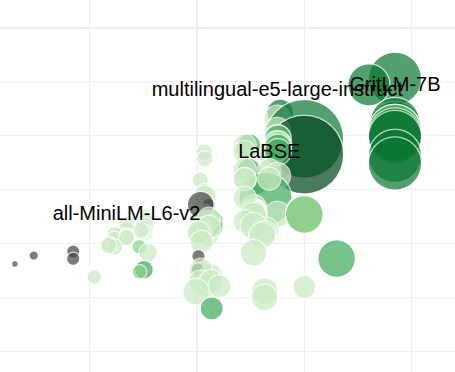
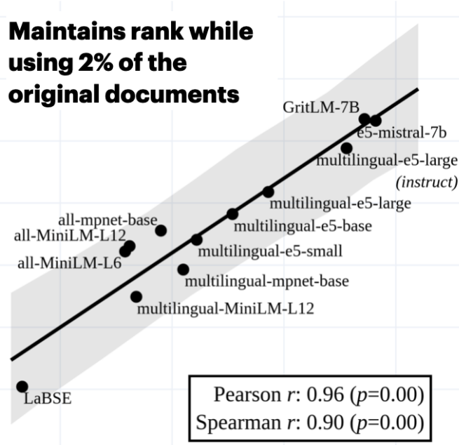

---
hide:
  - navigation
  - toc
---

 
     
    <h1 style="font-size: 5rem; font-weight: bold; color: #333; margin: 0;">Aarhus NLP</h1> 

# 

Welcome to Aarhus NLP.
We are a research group at Aarhus University investigating and developing Natural Language Processing and AI.
Our efforts include model evaluation and post-training, representation learning, and development of software libraries for NLP researchers.
We are also committed to developing state-of-the-art language technology for the Scandinavian countries.

## Research Areas

-     **Representation Learning** { width="100" align="right"}

      ---

      Numerical representations underlie a substantial body of modern science and engineering. We aim to develop methods for learning meaningful, nontrivial and faithful representations of data. We believe that better representations ultimately result in more performant, robust and interpretable NLP systems in both production and research. 

-     **Multilingual NLP** { width="100" align="right"}

      ---

      Good systems do not only work in one language and we believe that especially performance on low-resource languages like Danish is important. Overly focusing on a narrow area, however, might lead to subpar models. We thus seek to encourage multilingual development and often act as language experts in the Scandinavian languages. 
      
    
-     **Evaluation and Benchmarking** { width="100" align="right"}

      ---

      To promote progress, we need reliable tools and methods to measure NLP systems' performance in challenging scenarios. We develop evaluation frameworks, metrics, and methods that provide insights into system capabilities and limitations.

-     **Culture appropriateness and value alignment** { align=right width="90" }

      ---

      NLP systems should be able to serve a wide range of communities, some of which might deviate from the angolphone world not only in linguistics but also in values and cultural considerations. Culturally inappropriate language technology can have profoundly negative consequences when utilized in the real world. Aarhus NLP aim to develop methods for aligning language technology with the needs of a particular community, primarily focusing on a European and Scandinavian context. 

## Core Values

-     **Open Science and Open Source Software** { width="80" align="right"}

      ---

      Many impactful developments in contemporary NLP are achieved without disclosing or publishing details about training data and procedure. We, at Aarhus NLP, believe in open science and therefore make our code available with open licences, and use publicly available and widely applicable training data, in order to make it trivial for users to comply with relevant regulations. 

-     **Efficiency and Lowering Environmental Impact** { width="100" align="right"}

      ---
      
      Many state-of-the-art technologies in NLP require substantial computational resources, which a) not all might have access to and b) has negative environmental impact, as more energy and bigger data centres are necessitated. Efficient software and technologies are key to making advancements in artificial intelligence accessible to a wider audience, thereby promoting equity, and do not damage our environment to the same extent due to lower energy usage.

