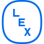
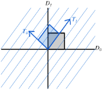

## Projects

-     **Danish Foundation Models**

      ---

      { align=right width="100" }

      A project spanning over multiple institutions and Danish universities dedicated to developing state-of-the art Danish language technology.

      :material-home: [foundationmodels.dk](https://www.foundationmodels.dk/)

-     **Lex LLM**

      ---

      { align=right width="100" }

      We are working together with the Danish National Lexicon, to develop a chatbot that will help users effectively navigate the vast amounts of curated knowledge on their website.

      :material-home: [lex.dk](https://mere.lex.dk/chatbot-faq/)
      
    

## Publication Highlights

-     { align=right width="50" } **MMTEB - Massive Multilingual Text Embedding Benchmark**  

      :material-pen:  ***Enevoldsen, K.***, *Chung, I., Kerboua, I.,* ***Kardos, M.*** ...   
      ---

      

      A large-scale multilingual expansion of MTEB, driven mainly by highly-curated community contributions covering 250+ languages.

      :material-home: [Leaderboard](https://huggingface.co/spaces/mteb/leaderboard)  
      :material-github: [Code](https://github.com/embeddings-benchmark/mteb)  
      :material-newspaper-variant: [Paper](https://openreview.net/forum?id=zl3pfz4VCV)

      
-    { width="50" align="right"} **The Scandinavian Embedding Benchmarks: Evaluating Multilingual and Monolingual Text Embedding for Scandinavian languages**  

      :material-pen:  ***Enevoldsen, K.***, ***Kardos, M.***, *Muennighoff, N.* & ***Nielbo, K. L.***   
      ---

      SEB is a comprehensive framework that enables text embedding evaluation for Scandinavian languages across 24 tasks, 10 subtasks, and 4 task categories.

      :material-home: [Leaderboard](https://kennethenevoldsen.github.io/scandinavian-embedding-benchmark/)  
      :material-github: [Code](https://github.com/KennethEnevoldsen/Scandinavian-Embedding-Benchmark)  
      :material-newspaper-variant: [Paper](https://proceedings.neurips.cc/paper_files/paper/2024/hash/4746bb91bd073ec7eef930d5775122ba-Abstract-Datasets_and_Benchmarks_Track.html)
      
    
-    { width="50" align="right"} **$S^3$ - Semantic Signal Separation**  

      :material-pen:  ***Kardos, M.***, *Kostkan, J., Vermillet, A.-Q.,* ***Nielbo, K., Enevoldsen, K.*** *& Rocca, R.*   
      ---

      A theory-driven topic modeling approach in neural embedding spaces, which conceptualizes topics as independent axes of semantic space.

      :material-github: [Code](https://github.com/x-tabdeveloping/turftopic)  
      :material-newspaper-variant: [Paper](https://arxiv.org/abs/2406.09556)
      
-    { width="50" align="right"} **`topicwizard` - a Modern, Model-agnostic Framework for Topic Model Visualization and Interpretation**  

      :material-pen:  ***Kardos, M., Enevoldsen, K. & Nielbo, K.***   
      ---

      A framework for model-agnostic topic model interpretation, that provides intuitive and interactive tools that help users examine the complex semantic relations between documents, words and topics learned by topic models.

      :material-github: [Code](https://github.com/x-tabdeveloping/topicwizard/tree/main)  
      :material-newspaper-variant: [Paper](https://arxiv.org/abs/2505.13034)
      

## All Publications

\full_bibliography
